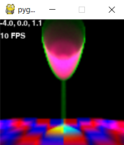

# 🌫️ fogpy 
## Volumetric rendering in python with [CuPy](https://docs-cupy.chainer.org/en/stable/index.html)
## Controls
* look up, left, right, down: WASD
* move left, right, forward, backward: arrow keys
* move up, down: SPACE, LSHIFT


##  Example Rendering


Rendering of `chalice_on_tiles`
with settings
```python
RESOLUTION = 100
SAMPLES = 400
FOV = 1
DEPTH = 10
UPSAMPLE_X, UPSAMPLE_Y = 2, 2
```
